# 도서 쇼핑몰 프로젝트

## 목차

1. [개요](#1-개요)
2. [실행화면](#2-실행화면)
3. [DB 설계](#3-db-설계)
4. [API 설계](#4-api-설계)
5. [마치며](#5-마치며)

## 1. 개요

- 프로젝트명 :  도서 쇼핑몰
- 목표 : 웹의 기본적인 기능을 구현할 수 있도록 간단한 도서 쇼핑몰 웹사이트를 만들고 기능을 점차 추가한다.
- 개발자 : 1명
- 주요 기능 :
    - 회원 관리 기능 : 회원 가입, 로그인, 회원 목록
    - 상품 기능 : 서적 등록, 서적 목록, 서적 검색
    - 주문 기능 : 서적 주문, 서적 주문 내역
- 개발 환경 : Java 17, Spring Boot 3.2.1, Spring Data JPA 3.2.1, Thymeleaf 3.2.1, Gradle 8.5
- 데이터베이스 : MySQL
- 형상관리 : Git
- 설명 : CRUD 기능을 구현하기 위한 간단한 인터넷 서점 웹사이트

## 2. 실행화면

실행화면 보기

- 홈 페이지
    
    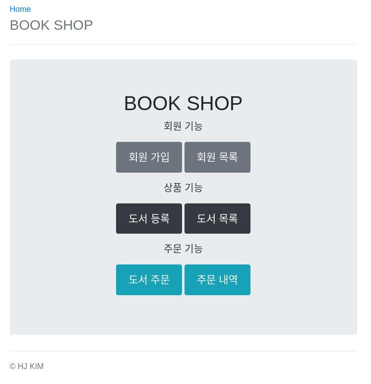

    웹 사이트의 다른 기능으로 이동할 수 있는 홈 페이지이다.
     
- 회원 등록 페이지
    
    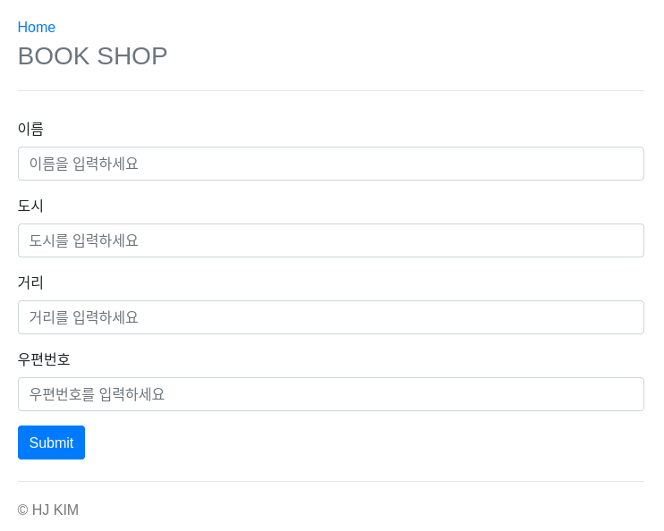
    
    새로운 회원을 등록할 수 있는 화면이다. 새로운 회원을 등록하면 회원 목록 페이지로 redirect 된다.
     
- 회원 목록 페이지
    
    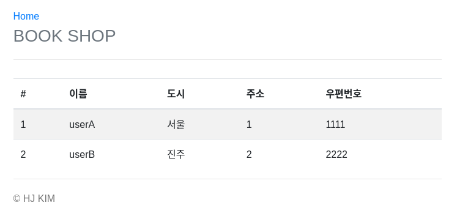
    
    등록된 회원의 목록을 조회할 수 있는 화면이다. 
     
- 도서 등록 페이지
    
    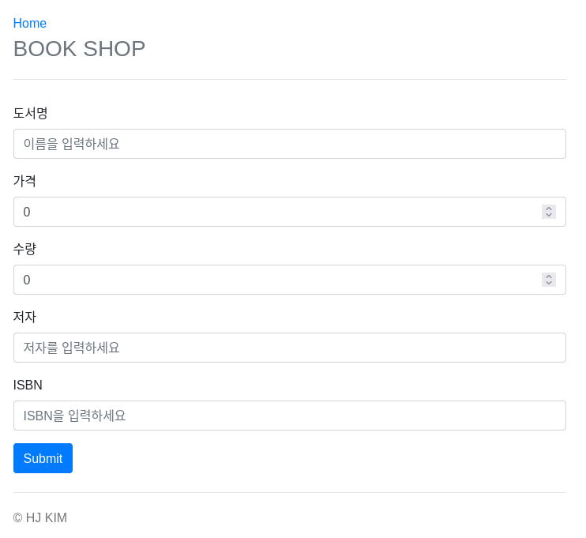
    
    새로운 도서 상품을 등록할 수 있는 화면이다. 가격과 수량은 숫자만 입력 가능하다. 도서를 새로 등록하면 도서 목록 페이지로 redirect 된다.
     
- 도서 목록 페이지
    
    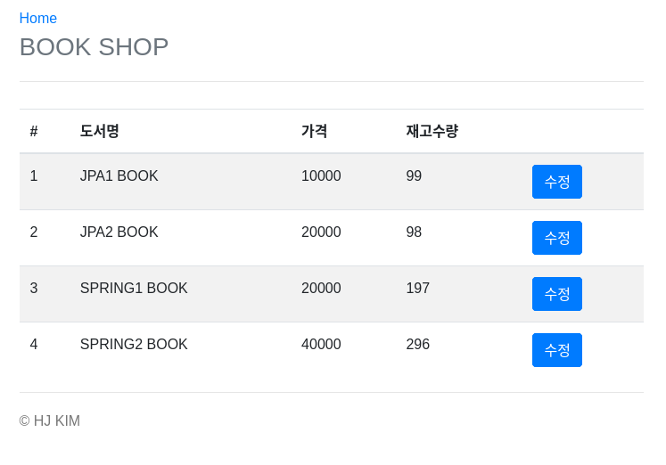
    
    등록된 도서 상품의 목록을 조회할 수 있는 화면이다. 수정 버튼을 누르면 도서 수정 페이지로 redirect 된다.
     
- 도서 수정 페이지
    
    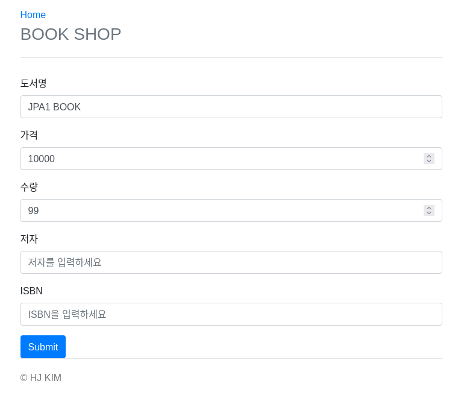
    
    등록된 도서의 내용을 수정할 수 있는 화면이다. 도서 등록 페이지와 동일한 양식이다.
     
- 도서 주문 페이지
    
    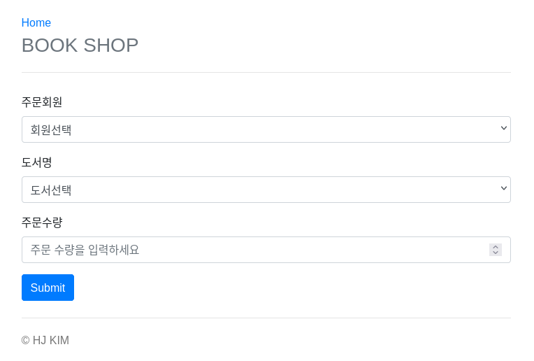
    
    도서를 새로 주문할 수 있는 화면이다. 주문 수량은 숫자만 입력 가능하다. 도서를 새로 등록하면 주문 내역 페이지로 redirect 된다.
     
- 주문 내역 페이지
    
    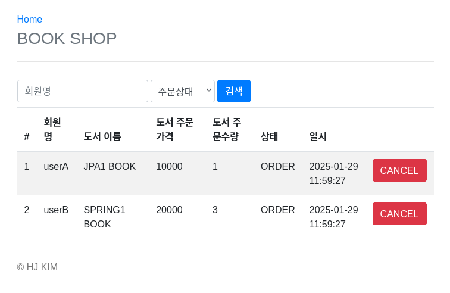
    
    주문한 도서 내역할 확인할 수 있는 화면이다. `Cancel` 버튼을 누르면 도서 상태가 `CANCEL`로 변경된다.
    

## 3. DB 설계

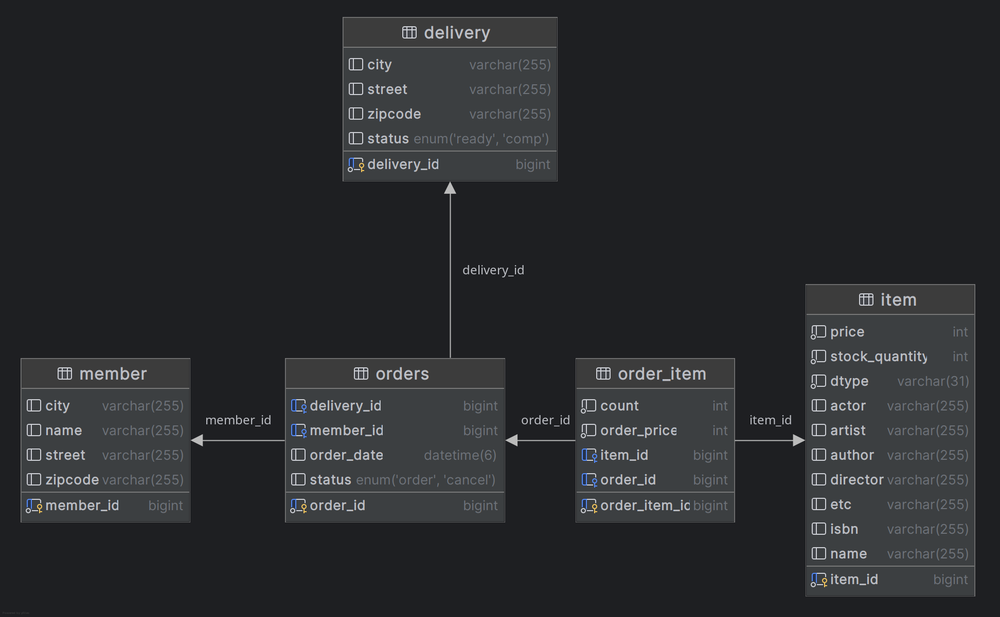

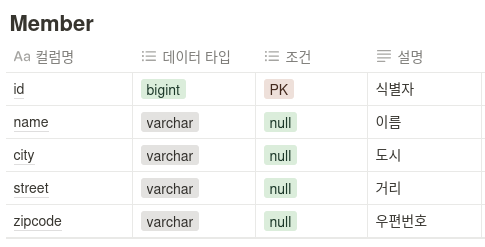

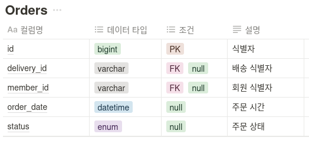

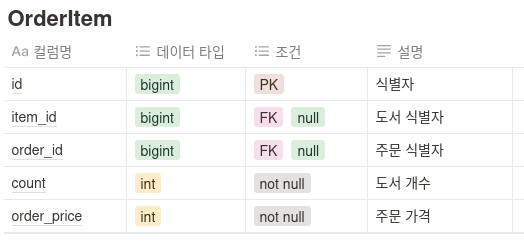

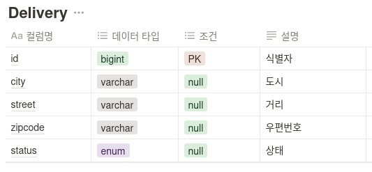

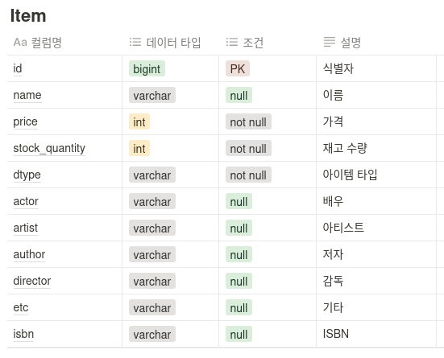

## 4. API 설계

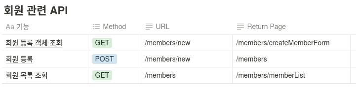

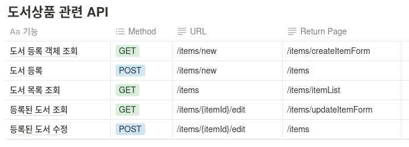

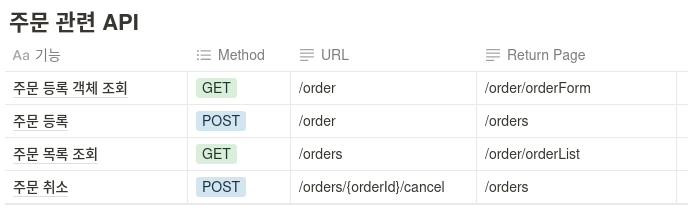

## 5. 마치며

### 보완할 점

회원을 등록하는 기능만 있고 회원가입 & 로그인 기능이 없다. 

동적쿼리를 JPQL로 구현하였는데 Querydsl로 변경하면 코드 가독성 측면에서 더 좋을 것이라고 생각한다. Spring Data JPA도 Member 관련 Repository에만 적용이 되었는데 Item, Order Repository에도 적용할 예정이다.

도서마다 상세 페이지와 댓글 기능을 만들어서 실제 도서 쇼핑몰에 가깝게 고도화 할 계획이다.
